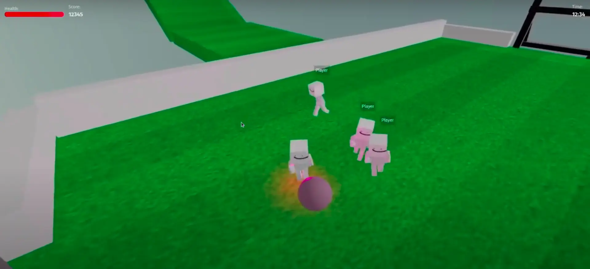

# Three JS Multiplayer Game Demo


### Online demo

Small demo here : [NotBlox.online](https://www.notblox.online/)

Hosted on an european server, there is no client side prediction, so the game may be laggy if you are far from the server.

### Controls

- W : Forward
- S : Backward
- A : Left
- D : Right
- Space : Jump
- Mouse Left click : Rotate screen

## Features

- Multiplayer
- Only TypeScript
- 3D Physics (Rapier.js)
- Vanilla Three.js
- Server Authoritative
- ECS (Entity Component System) with Network Sync (NetworkComponent)
- ~Delta Compression~ (needs rework)
- Interpolation
- Fast to load (small assets)
- Shared code between server and client (useful for component replication)
- Trimesh Collider 

 
## Why ?

Browser games are fun, but most of them are Unity WebGL exports that take a long time to load.
I wanted to create a simple multiplayer game engine using Three.js and my own ECS. This project has in mind to be a simple and fast game engine that can be used to create simple multiplayer games with the modularity of ECS.

### Multiplayer GTA-like ?

I'm thinking about creating a GTA-like game with this engine. It would be a simple game with a city, cars, and players. The game would be server-authoritative, and the server would be able to spawn cars, NPCs, and other entities. The game would be a simple sandbox game where players can interact with each other and the environment.
Inspiration : https://github.com/swift502/Sketchbook

## Demo (Click on the images to see the video)

[](https://www.youtube.com/watch?v=7vBifZ2qG1k "See on youtube")

[](https://www.youtube.com/watch?v=Uu3VCuyD9EA "See on youtube")

 

## How to run

### Back-end

Modify the `back/.env` file with `NODE_ENV=development`

```bash
  cd back
  npm install
  npm run dev
```

### Front-end

Uncomment the `NEXT_PUBLIC_SERVER_URL` variable in `front/.env.local`, it will default to localhost

```bash
  cd front
  npm install
  npm run dev
```

## How to change the map

A map is a GLB/GLTF file. The backend will approximate a Trimesh Collider based on it, and it is then rendered by the client.

Go to the file : `back/src/ecs/entity/MapWorld.ts`

```typescript
export class MapWorld {
  entity: Entity
  constructor() {
    this.entity = EntityManager.createEntity(SerializedEntityType.WORLD)

    // URL of the GLB/GLTF file (Change this)
    const mapUrl = 'https://rawcdn.githack.com/iErcann/Notblox-Assets/610c6492aa88e5a6b5107a38e1a7c34cc43d9e81/KenneyWorld.glb'

    // Server-side mesh for rendering
    const serverMeshComponent = new ServerMeshComponent(this.entity.id, mapUrl)
    this.entity.addComponent(serverMeshComponent)

    // Static (kinematic) property for the map
    this.entity.addComponent(new KinematicRigidBodyComponent(this.entity.id))

    // Trimesh collider approximation based on the map
    this.entity.addComponent(new TrimeshCollidersComponent(this.entity.id, mapUrl))

    // Sending only the visual data (mesh URL file)
    this.entity.addComponent(
      new NetworkDataComponent(this.entity.id, this.entity.type, [serverMeshComponent])
    )
  }
}

```

### Blender: How to Export a Map Correctly

**1. Apply All Transforms**

- Press `CTRL-A` and select "All Transforms" to apply all transformations.


**2. Clear Parents**

- Press `A` to select all objects, then `CTRL-P` and choose "Clear Parent" to remove all parent relationships.


**3. Export with Compression**

- Choose GLB/GLTF export.


- Activate compression.


### Free asset hosting
Github Repo + Githack : 

https://gist.github.com/jcubic/a8b8c979d200ffde13cc08505f7a6436#how-to-setup-a-literally-free-cdn

 
## Current Event system (might change!)
 
[Is it better design to store event effects within an Entity itself, or within a system?](https://gamedev.stackexchange.com/questions/194133/is-it-better-design-to-store-event-effects-within-an-entity-itself-or-within-a)
 >If you are using event queues anyway, you can also do them properly. With one global EventManager system which receives all events. Systems can subscribe to events they are interested in and then the EventManager will put those events into their event queues.


-  `Component` can also be a `NetworkComponent`. This means it can be sent over the network to be replicated by the clients.

### Shared
```js
// Shared component between client & back
export class ColorComponent extends NetworkComponent {
  constructor(entityId: number, public color: string);
  deserialize(data: SerializedColorComponent);
  serialize(): SerializedColorComponent;
}
```

### Back
The back-end need to pass some events; This is achieved with the event components (example: `EventColorComponent`) that are only used once per ECS loop and then removed from the EventQueue entity.

```js
// Creating a color change event on the back
EventSystem.addEvent(new ColorEvent(yourEntity.id, "#FFFFFF"));
```
It can be received by any system, here `ColorEventSystem` : 

The `ColorComponent` is updated:
```js
export class ColorEventSystem {
  update(entities: Entity[]) {
    const eventColors = EventSystem.getEvents(ColorEvent)

    for (const eventColor of eventColors) {
      const entity = EntityManager.getEntityById(entities, eventColor.entityId)
      if (!entity) return

      const colorComponent = entity.getComponent(ColorComponent)
      if (!colorComponent) return

      if (colorComponent && eventColor) {
        colorComponent.color = eventColor.color
        colorComponent.updated = true
      }
    }
  }
}
```

### Client (front-end)
The component is replicated by the client with the `SyncComponentsSystem.ts`, then it uses the front-end version of `SyncColorSystem` to actually change the color of the mesh, you could incorporate more checks here depending on other components

```js
export class SyncColorSystem {
  update(entities: Entity[]) {
    for (const entity of entities) {
      const colorComponent = entity.getComponent(ColorComponent);
      const meshComponent = entity.getComponent(MeshComponent);
      if (colorComponent && meshComponent && colorComponent.updated) {
        meshComponent.mesh.material = new THREE.MeshPhongMaterial({
          color: colorComponent.color,
        });
      }
    }
  }
}
```


## You like this project or want to talk about Three.js games ? 
Discord  https://discord.gg/aEBXPtFwgU 👀


### Shared file import Error .js files fix

[Link to GitHub Discussion](https://github.com/vercel/next.js/discussions/32237)
 
 
 
## Asset Credits

San Andreas Map :
https://skfb.ly/oJSPS

Kenney Assets
https://www.kenney.nl/
